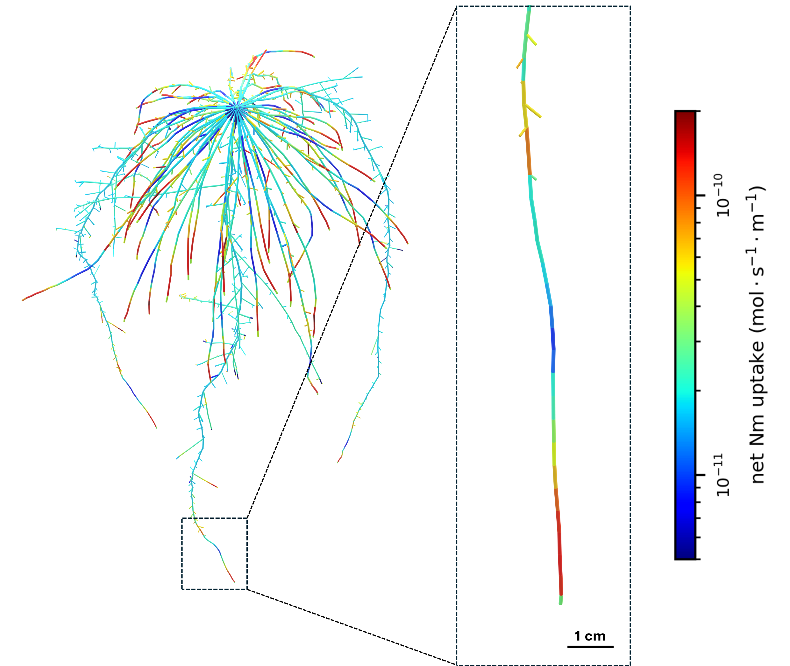

# Root-CyNAPS : Root Cycling Nitrogen Across Plant Scales
#### A 3D root FSPM to simulate nitrogen transport and metabolism, water transport and root tissue anatomy

[](https://github.com/openalea/root-cynaps/actions/workflows/conda-package-build.yml)
[](https://root-cynaps.readthedocs.io/en/latest/?badge=latest)
[](https://anaconda.org/openalea3/openalea.rootcynaps)

## Software

### Authors
Tristan Gérault, Christophe Pradal, Romain Barillot, Céline Richard-Molard, Marion Gauthier, Alexandra Jullien, Frédéric Rees

### Institutes

INRAE / AgroParisTech / CIRAD / INRIA

### License

CecILL-C

Python package

**URL** (Not available yet): <https://root-cynaps.rtfd.io>

## About

### Root-CyNAPS Description

Root-CyNAPS is a 3D root FSPM accounting for a set of N-related processes regulated by local metabolite concentrations, local soil temperature, local exchange surfaces and local structural mass in a root segment. Root segments are defined from a subdivision of a root system architecture into segments. 

Included processes are N and water uptake, N2 fixation by nodules and N acquisition by mycorrhiza, N exudation, N local assimilation, and N and water transport along xylem and phloem vessels. The balance of these processes modifies the local concentrations of labile N in three distinct compartments of the root segment: 1) parenchyma symplasm, 2) phloem symplasm, and 3) xylem apoplasm. The parenchyma apoplasm is not represented and is supposed to be at equilibrium with the soil solution. 

Labile N is divided into a mineral form, accounting for nitrate and ammonium, and an organic form, accounting for total amino acids. Amino acids can in turn contribute to a storage protein pool or to the root segment dry structural mass as structural N.

Processes at the root segment-scale are then scaled up to the entire root system by summing the contribution of individual segments, while also accounting for heterogeneous water and solutes transport processes between segments through xylem and phloem. 

Root-CyNAPS simulates heterogeneous fluxes across a static 3D root architecture at hourly time-steps, regulated by local root and soil conditions. Root architecture is provided as an input of the model, along with growth costs and labile hexose concentration profiles in the root system, water potentials and labile N concentrations at the shoot-root interface, and soil N, water, and temperature boundary conditions.

### Content of the Package

The OpenAlea.Root-CyNAPS package contains modules for simulating nitrogen cycle, water transport and anatomy sequentially in individual root segments of a root system architecture. Here we illustrated the assembly of these 3 modules to create a model named Root-CyNAPS, which solves nitrogen transport and metabolic fluxes using finite differences over a short time step. It also implements a solver for water and solute transport in both xylem and phloem using a Newton-Raphson method applied on a matricial representation of the system. 

### Example output

Representation of root segments net N uptake simulated by Root-CyNAPS along the roots of a 50 days-old spring wheat root system architecture (homogeneous 20°C and 0.5 mM nitrate of nutrient solution)



### Installation

#### Install Conda

Intall the lastest version of conda : https://docs.conda.io/projects/miniconda/en/latest/miniconda-install.html.  

Then open an anaconda terminal and install mamba in your base environement for robust package management: 
```
conda install -c conda-forge mamba
```


#### User Conda Installation (Available soon)

Create an environment in which to install OpenAlea.Root-CyNAPS
```
mamba create -n root-cynaps -c conda-forge -c openalea3 openalea.rootcynaps
```


#### Developer Installation

Also install the latest version of git to retreive and version code : https://git-scm.com/downloads

First, in *YourPythonProjects* folder, clone or fork the repository to retreive source code of Root-CyNAPS and its utilitary packages :
```
git clone git@github.com:openalea/Root-CyNAPS.git
git clone git@github.com:openalea/metafspm.git
git clone git@github.com:openalea/fspm-utility.git
```

Then create and activate a conda environment in which to install Root-CyNAPS requirements into
```
mamba create -n root-cynaps -c conda-forge python
mamba activate root-cynaps
```

Finally to install model's dependencies, for each of these 3 packages, get to the root of the package and install the package using *pip* (repeat this step everytime you make change to the source code):

```
cd .../YourPythonProjects/Root-CyNAPS
pip install .
cd ..
cd .../YourPythonProjects/metafspm
pip install .
cd ..
cd .../YourPythonProjects/fspm-utility
pip install .
```


#### Requirements installed by Root-CyNAPS

> -   openalea.mtg
> -   openalea.plantgl
> -   pandas
> -   numpy
> -   scipy
> -   pyyaml
> -   xarray
> -   pyvista
> -   matplotlib
> -   pint
> -   trimesh
> -   salib

### Launch a reference simulation

#### User

[See the example usage notebook](doc/notebooks/example_notebook_24h_static.ipynb) in the doc directory.

#### Developper
Go to the *Root-CyNAPS/simulations/scene folder*, then run and adapt the reference simulation script (*simulation_24h_static.py*) with:
```
cd .../YourPythonProjects/Root-CyNAPS/simulations/scene
mamba activate root-cynaps
python simulation_24h_static.py
```

## Documentation

Link not available yet

## Citations

RootCyNAPS has been submitted for publication. For now, please cite:

    Tristan Gérault, Christophe Pradal, Romain Barillot, Céline Richard-Molard, Marion Gauthier, Alexandra Jullien, Frédéric Rees, 
    "Do specific root zones shape plant net N uptake? Modeling insights from Root-CyNAPS", submitted

## Contributors

<a href="https://github.com/openalea/root-cynaps/graphs/contributors">
  
</a>